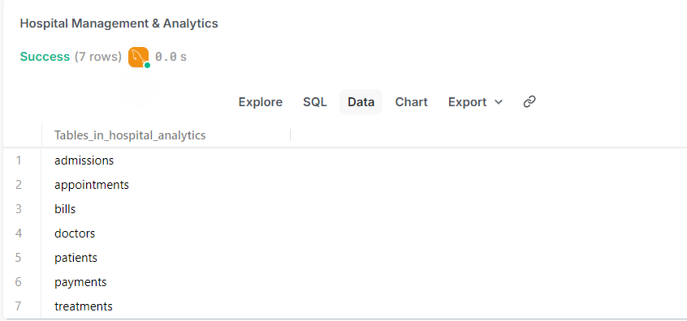
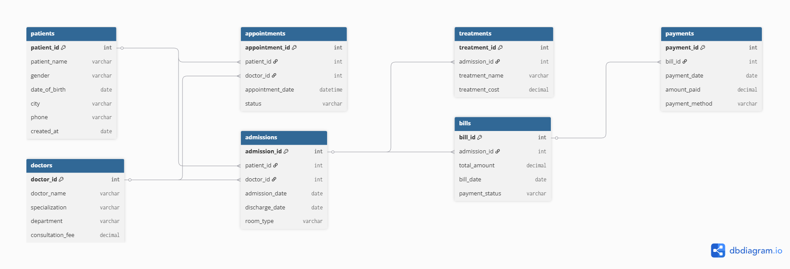
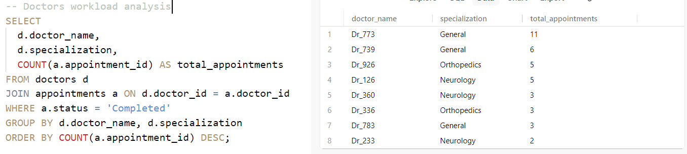

# Hospital Analysis using SQL (MySQL)

## 📌 Project Overview
This project performs end-to-end hospital data analysis using MySQL.
It covers patient management, doctor workload, admissions, treatments,
billing, and payments using a relational database design.

## 🛠 Tools & Technologies
- MySQL
- PopSQL
- GitHub

## 🗂 Database Design

### Tables Overview

### ER Diagram

## 📊 Key Analysis Performed
- Doctor workload analysis
- Monthly hospital revenue
- Patient admission trends
- Treatment cost analysis
- Billing and payment tracking

## 📈 Sample Analysis Output

## 📁 Project Structure
hospital-analysis-sql/
├── schema/
│   └── create_tables.sql
├── data/
│   └── insert_data.sql
├── analysis/
│   └── hospital_queries.sql
├── screenshots/
│   ├── tables.png
│   ├── er_diagram.png
│   └── sample_output.png
└── README.md

## 📜 SQL Files

- **Database Schema (CREATE TABLE)**  
  👉 [create_tables.sql](schema/create_tables.sql)

- **Data Insertion Scripts (INSERT INTO)**  
  👉 [insert_data.sql](data/insert_data.sql)

- **Hospital Analytics Queries**  
  👉 [hospital_queries.sql](analysis/hospital_queries.sql)

## ✅ Key Learnings
- Designed normalized hospital database schema
- Implemented foreign key constraints
- Wrote complex SQL JOIN and aggregation queries
- Converted operational hospital data into insights

## 🚀 Conclusion
This project demonstrates real-world SQL skills required for
Data Analyst and Backend Developer roles.
